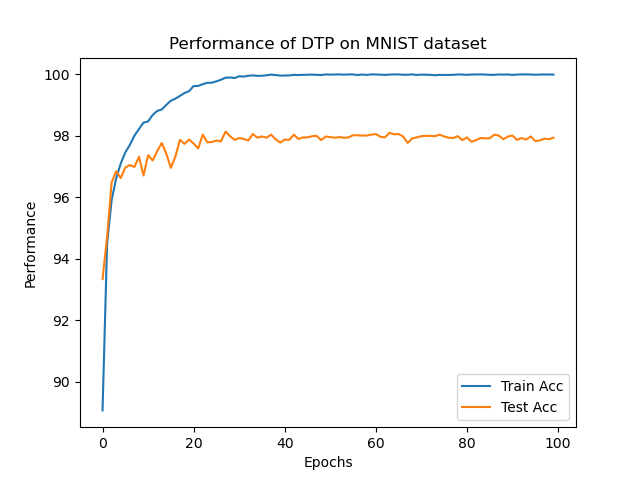

# Difference Target Propagation
Reiplement the difference target propagation based on PyTorch, the original code can be find
> https://github.com/donghyunlee/dtp
## Requirements
* python 3.7
* torch
* torchvision
* numpy
## Results
We train the model for 100 epochs, and the best accuracy is 98.14%.

